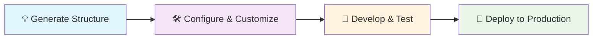

<div align="center">

# AgentCLI

**The definitive AI agent project scaffolding tool**

<br>

[](https://www.python.org/downloads/)
[](https://www.npmjs.com/)
[](https://opensource.org/licenses/MIT)
[](https://github.com/StamKavid/agent-cli)

**[🚀 Quick Start](#-quick-start)** • **[🏗️ Project Architecture](#️-project-architecture)** • **[📖 Documentation](#-documentation)**

</div>

<br>
<br>

## 🚀 Quick Start

<table>
<tr>
<td width="50%">

### 📋 Prerequisites
- **Node.js** for instant setup
- **Python 3.10+** for development
- **Your favorite code editor**

</td>
<td width="50%">

### ⚡ One-Command Setup
```bash
npx stamkavid-agent-cli my-agent
cd my-agent && pip install -e .
```
**Done!** Your complete AI agent project structure is generated and ready for development.

</td>
</tr>
</table>

<br>

<div align="center">

### 🎨 What Makes This Special?

<table>
<tr>
<td align="center" width="33%">

**🏗️ Project Structure Generator**

Complete directory hierarchy  
Pre-configured files & templates  
Production-ready foundation

</td>
<td align="center" width="33%">

**🚀 Instant Scaffolding**

Complete project in seconds  
No manual directory creation  
Ready-to-use file templates

</td>
<td align="center" width="34%">

**🔧 Production Foundation**

Docker & K8s templates included  
CI/CD pipeline structure  
Monitoring setup scaffolding

</td>
</tr>
</table>

</div>

<br>

## 🔧 Installation & Setup

### Method 1: NPX (Recommended)

**Quick Start:**
```bash
npx stamkavid-agent-cli my-agent
cd my-agent && pip install -e .
```

**If you encounter issues** (e.g., "Cannot find module" or "externally-managed-environment"):

```bash
# Step 1: Clear any corrupted dependencies
rm -rf node_modules package-lock.json
npm install

# Step 2: Create Python virtual environment
python3 -m venv agent-cli-venv
source agent-cli-venv/bin/activate

# Step 3: Install the Python package locally
pip install -e .

# Step 4: Test the setup
npx stamkavid-agent-cli --help
```

### Method 2: Global Installation

```bash
# Install globally via npm
npm install -g stamkavid-agent-cli

# Then use directly
agent-cli my-project
# or
agent my-project
# or  
agentcli my-project
```

### Method 3: From Source (Developers)

```bash
git clone https://github.com/StamKavid/agent-cli.git
cd agent-cli

# Create and activate virtual environment
python3 -m venv agent-cli-venv
source agent-cli-venv/bin/activate

# Install in development mode
pip install -e .

# Test installation
agent-cli --help
```

<br>

## 🏗️ Project Architecture

<div align="center">

### 📁 **Project Structure Generator - Complete Scaffolding**

*Generate complete directory hierarchies and file templates. Every folder has a purpose. Every file has its template.*

</div>

<br>

<details open>
<summary><strong>🎯 Core Agent Structure</strong></summary>

```
src/your_agent/
├── agent/                      # 🤖 The brain of your AI
│   ├── base_agent.py          #    Core agent interface
│   ├── langgraph_agent.py     #    Advanced workflow engine
│   └── state_manager.py       #    Conversation state handling
│
├── memory/                     # 🧠 Knowledge & conversation history
│   ├── vector_store.py        #    Semantic search capabilities
│   ├── conversation_memory.py #    Context management
│   └── langmem_integration.py #    Advanced memory systems
│
├── tools/                      # 🛠️ Agent capabilities
│   ├── base_tool.py           #    Tool interface standard
│   ├── web_search.py          #    Internet access
│   ├── file_operations.py     #    File system interaction
│   └── custom_tools.py        #    Your unique tools
│
└── workflows/                  # 🔄 Complex task orchestration
    ├── workflow_builder.py    #    Visual workflow design
    └── common_workflows.py    #    Pre-built patterns
```

</details>

<details>
<summary><strong>📚 Prompt Engineering Hub</strong></summary>

```
src/your_agent/prompts/
├── prompt_manager.py           # 📝 Lifecycle management
├── prompt_library.py          # 📖 Centralized collection
├── templates/                  # 🎨 Reusable patterns
│   ├── system_prompts.py      #    Core agent personality
│   ├── user_prompts.py        #    User interaction templates
│   ├── tool_prompts.py        #    Tool usage instructions
│   └── workflow_prompts.py    #    Complex task guidance
└── versions/                   # 📈 A/B testing & iteration
    ├── v1_prompts.py          #    Baseline prompts
    └── v2_prompts.py          #    Improved versions
```

</details>

<details>
<summary><strong>🚀 Production Infrastructure</strong></summary>

```
├── api/                        # 🌐 RESTful interface
│   ├── app.py                 #    FastAPI application
│   ├── routes.py              #    Endpoint definitions
│   └── schemas.py             #    Data validation
│
├── observability/              # 📊 Monitoring & analytics
│   ├── opik_integration.py    #    Performance tracking
│   └── metrics.py             #    Custom monitoring
│
├── configs/                    # ⚙️ Environment management
│   ├── agent_config.yaml      #    Agent behavior settings
│   ├── llm_config.yaml        #    Model configurations
│   └── deployment_config.yaml #    Infrastructure setup
│
└── notebooks/                  # 🧪 Interactive development
    ├── 01_prompt_engineering.ipynb  # Design & test prompts
    ├── 02_memory_experiments.ipynb  # Memory system tuning
    ├── 03_tool_integration.ipynb    # Capability development
    └── 04_evaluation.ipynb          # Performance analysis
```

</details>

### 🔄 **Development Workflow**



<details>
<summary><strong>📋 Step-by-Step Development Guide</strong></summary>

```bash
# 1️⃣ Generate your complete project structure
npx stamkavid-agent-cli my-intelligent-agent
cd my-intelligent-agent

# 2️⃣ Set up your development environment  
cp .env.example .env
# Add your API keys (OpenAI, Anthropic, etc.)

# 3️⃣ Install dependencies and activate
pip install -e .

# 4️⃣ Start developing with generated templates
jupyter lab notebooks/01_prompt_engineering.ipynb

# 5️⃣ Run your agent using the generated structure
python -m my_intelligent_agent

# 6️⃣ Test using the generated test framework
pytest tests/

# 7️⃣ Deploy using generated Docker configuration
docker build -t my-agent .
docker run -p 8000:8000 my-agent
```

</details>

<br>

## 📖 Documentation

<div align="center">

### 🤝 **Join the AgentCLI Community**

*Help us build the future of AI agent development*

</div>

<br>

<table>
<tr>
<td width="50%">

### 🚀 **For Contributors**

**Quick Setup:**
```bash
git clone https://github.com/StamKavid/agent-cli.git
cd agent-cli
python3 -m venv venv
source venv/bin/activate
pip install -e ".[dev]"
```

**Development Workflow:**
1. Fork & clone the repository
2. Create feature branch: `git checkout -b feature/amazing-improvement`
3. Make changes & add tests
4. Run test suite: `pytest`
5. Submit pull request

</td>
<td width="50%">

### 🔧 **Advanced Configuration**

<details>
<summary><strong>Custom Templates</strong></summary>

Create your own project templates:
```python
# Add to src/agent_cli/templates/
custom_template = {
    "name": "my-template",
    "structure": {...},
    "dependencies": [...]
}
```

</details>

<details>
<summary><strong>CLI Extensions</strong></summary>

Extend AgentCLI functionality:
```bash
agent-cli --template=custom
agent-cli --integrations=slack,discord
agent-cli --deployment=aws,gcp
```

</details>

</td>
</tr>
</table>

<br>

### 🛠️ **Troubleshooting**

<details>
<summary><strong>🐍 Python Environment Issues</strong></summary>

```bash
# Python version conflicts
python3 --version  # Ensure 3.10+
python3 -m venv venv --clear

# Package installation problems
pip install --upgrade pip
pip install -e ".[dev]" --no-cache-dir
```

</details>

<details>
<summary><strong>🔧 NPM Package Setup Issues</strong></summary>

If you encounter issues with the npm wrapper (e.g., "Cannot find module" or "externally-managed-environment" errors), follow these steps:

```bash
# 1. Clear and reinstall npm dependencies
rm -rf node_modules package-lock.json
npm install

# 2. Create a Python virtual environment for the project
python3 -m venv agent-cli-venv
source agent-cli-venv/bin/activate

# 3. Install the local Python package in editable mode
pip install -e .

# 4. Test the setup
npx agent-cli --help
# or
npx stamkavid-agent-cli --help
```

**Why this works:** The npm wrapper needs access to the Python `agent-cli` package. Creating a virtual environment and installing the package locally ensures the wrapper can find and execute the Python CLI correctly.

**Alternative if pipx is available:**
```bash
# If you have pipx installed (recommended for macOS)
pipx install agent-cli
# Then run: npx agent-cli --help
```

</details>

<details>
<summary><strong>📦 Project Generation Issues</strong></summary>

```bash
# Validate templates
agent-cli validate-templates

# Debug mode
agent-cli create my-project --verbose --debug

# Permission issues
chmod +x $(which agent-cli)
```

</details>

<details>
<summary><strong>🚀 Deployment Problems</strong></summary>

```bash
# Docker build issues
docker system prune
docker build --no-cache -t my-agent .

# Environment variables
cat .env.example > .env
# Edit .env with your configuration
```

</details>

<br>

---

<br>

<div align="center">

## 🌟 **Additional Resources**

<table>
<tr>
<td width="50%">

### **Documentation & Examples**
```bash
# Browse generated examples
cd my-agent/examples/
# View templates
ls src/templates/
```
*Complete project examples and templates*

</td>
<td width="50%">

### **Python Package Only**
```bash
# Direct Python installation
pipx install agent-cli
# or
pip install agent-cli
```
*For Python-only environments*

</td>
</tr>
</table>

</div>

<br>

---

<div align="center">

## 📄 **License & Attribution**

**MIT License** - Use freely in commercial and personal projects

<br>

### 🙏 **Acknowledgments**

Built with inspiration from [Miguel Otero Pedrido](https://github.com/MichaelisTrofficus) and the [Neural Maze](https://github.com/neural-maze) community.

<br>

### 🔗 **Connect & Contribute**

[](https://github.com/StamKavid/agent-cli)
[](https://github.com/StamKavid/agent-cli/issues)
[](https://github.com/StamKavid/agent-cli/blob/main/CONTRIBUTING.md)

<br>

### 🚀 **Ready to Generate Your AI Agent Project Structure?**

<br>

*Built by developers, for developers. Make AI agent project scaffolding as simple as it should be.*

</div>
